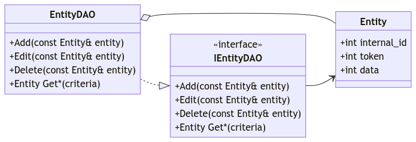

# Data access object pattern
## Intent
This pattern abstracts access to a data storage from the code that works with the actual data. It is often used in the context of databases. Basically it can be seen as a container that works according to the [CRUD principle](https://en.wikipedia.org/wiki/Create,_read,_update_and_delete). The storage can also be just RAM which i assume here.

## Class diagram

* Client classes can access the data-access-object through the abstract interface `IEntityDAO`.
* Each CRUD operation is performed via the `IEntityDAO` interface. 

## Credits
* [Github-Repo: Design patterns implemented in Java / DAO Pattern](https://github.com/iluwatar/java-design-patterns/tree/master/dao)
* [The DAO Pattern in Java](https://www.baeldung.com/java-dao-pattern)